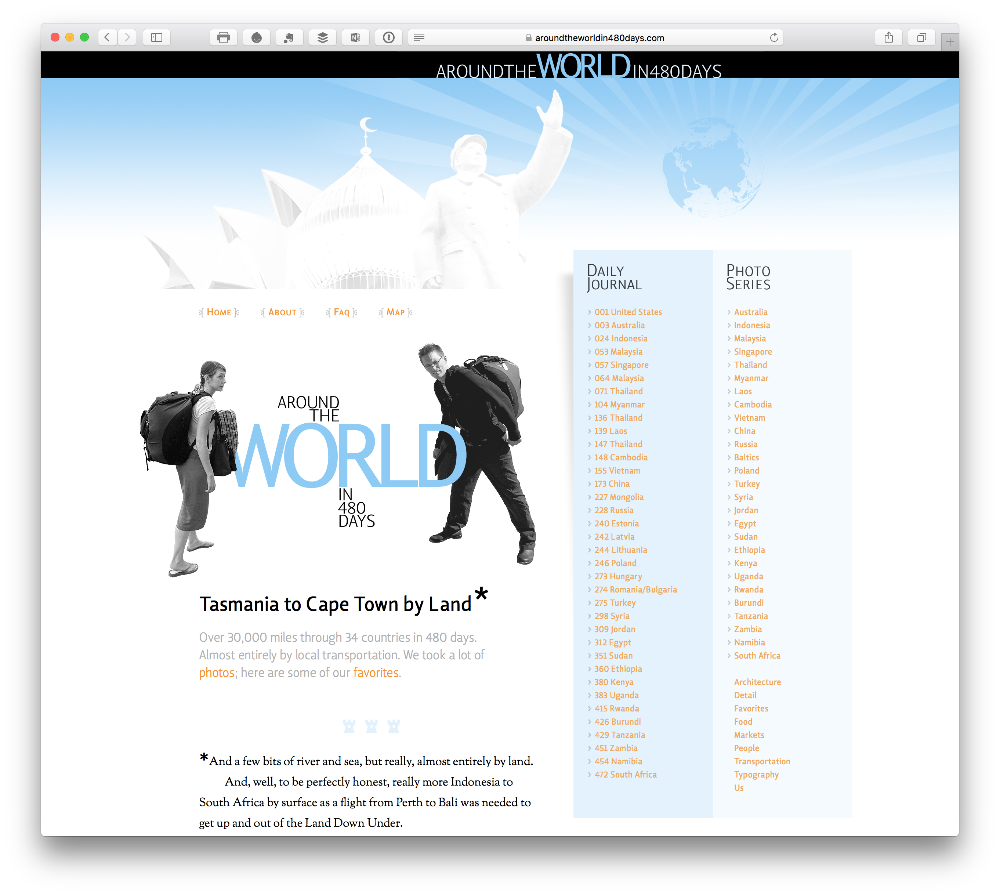
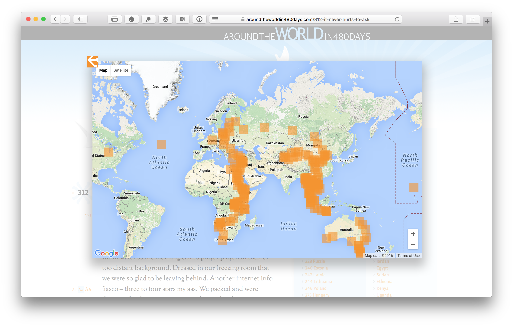

# Around the World in 480 Days
A travelogue

A labor of love that took nearly 10 years to complete. Originally designed and built in 2006, a good portion of the development time was spent getting this heavily JavaScript-laden WordPress site to look and perform acceptably on Internet Explorer 6. But as it then took nearly another decade to add all the content, by the time the site was finally completed IE6 had long since disappered from the web browsing landscape. I am still bitter.

